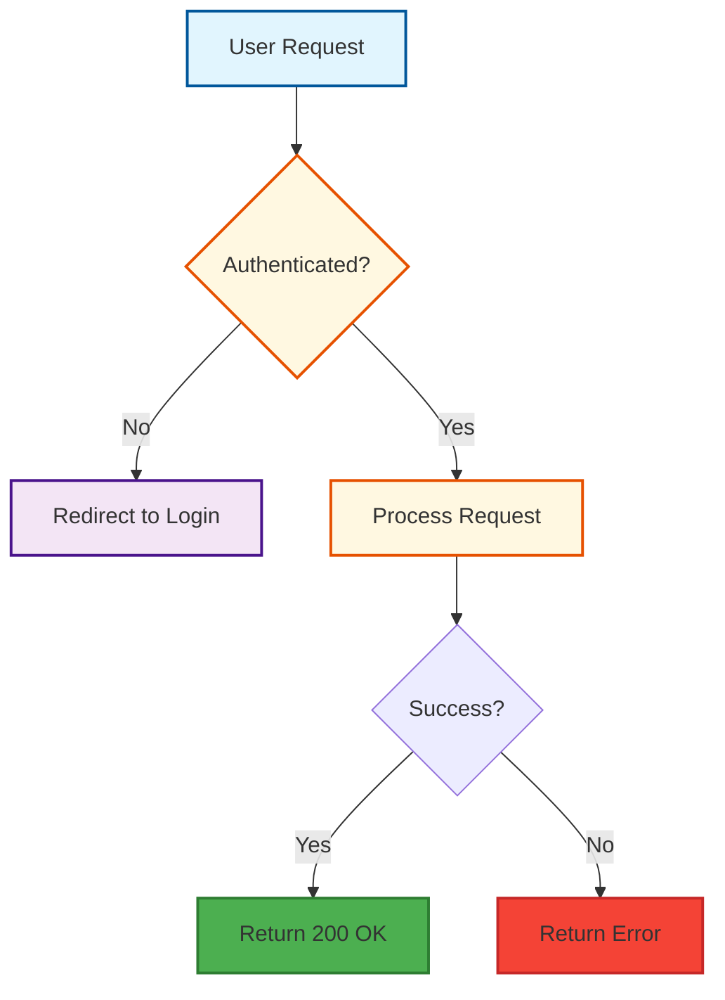

# Documentation Standards

Guidelines for creating consistent and beautiful documentation.

## Markdown Structure

### Standard Layout
```markdown
# [Title]

[Brief description of purpose]

## Table of Contents
- [Section 1](#section-1)
- [Section 2](#section-2)

## Section 1
[Content]

## Section 2
[Content]
```

### Headings
- Use `Title Case` for Level 1 headers.
- Use `Sentence case` for Level 2+ headers.
- Keep depth shallow (max 3 levels deep preferably).

## Mermaid Diagrams

Use Mermaid for all architectural and flow diagrams.

### Style Guide
We use a specific color palette for consistency:

- **Primary (Blue)**: `#e1f5fe` / `#01579b` (Questions, Main Nodes)
- **Secondary (Purple)**: `#f3e5f5` / `#4a148c` (Options, Values)
- **Action (Yellow)**: `#fff8e1` / `#e65100` (Processing, Steps)
- **Success (Green)**: `#4caf50` / `#2e7d32` (Yes, Done)
- **Error (Red)**: `#f44336` / `#c62828` (No, Failure)

### Example Flowchart


### Styling Syntax
Include this block at the end of your mermaid graph:
```mermaid
    style NodeName fill:#e1f5fe,stroke:#01579b,stroke-width:2px,color:#000000
```

## API Documentation

Using `description` fields in FastAPI Pydantic models automatically generates rich docs.

```python
class PropertyBase(BaseModel):
    title: str = Field(
        ...,
        description="The full title of the listing",
        examples=["Sunny Apartment in Amsterdam"]
    )
```
