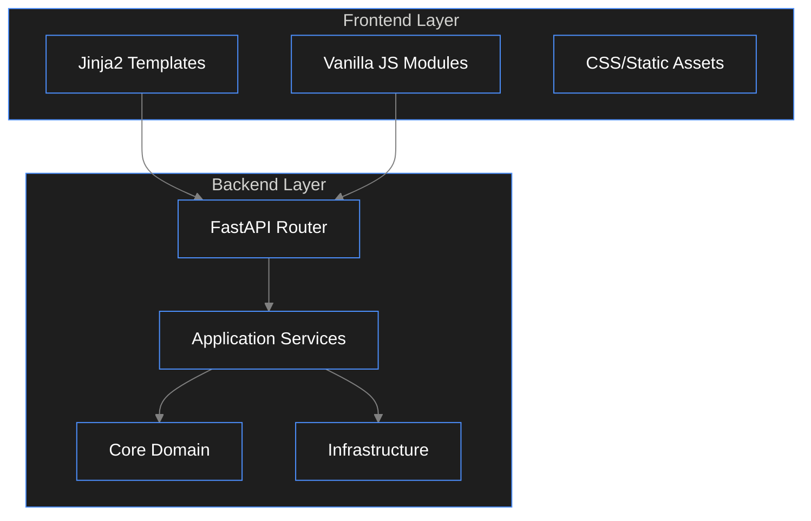

# Architecture Overview

Guidelines for the hybrid FastAPI backend + server-side rendered frontend architecture.

## System Design



## Directory Structure

### Backend
- `core/`: Pure python code. No DB drivers, no HTTP frameworks.
    - Entities: Data classes
    - Interfaces: Abstract base classes
    - Services: Business logic
- `infrastructure/`: External tools.
    - Repositories: Database implementations
    - External APIs: 3rd party integrations
- `presentation/`: Entry points.
    - API: REST endpoints
    - Web: HTML/Template routes

### Frontend
- `templates/`: Jinja2 HTML templates
    - `layouts/`: Base layouts (base.html)
    - `components/`: Reusable partials
    - `pages/`: Full page templates
- `static/`: Served directly
    - `css/`: Stylesheets
    - `js/`: JavaScript modules
    - `img/`: Images/Assets

## Integration Patterns

### 1. Template Rendering
Use `Jinja2Templates` for server-side rendering of initial state.

```python
@router.get("/properties", response_class=HTMLResponse)
async def list_properties(request: Request):
    return templates.TemplateResponse("properties/list.html", {
        "request": request,
        "initial_data": [...]
    })
```

### 2. Interactive Frontend
Use Vanilla JS modules for interactivity, communicating via JSON APIs.

```javascript
// static/js/modules/property-filter.js
export class PropertyFilter {
    constructor(apiEndpoint) {
        this.endpoint = apiEndpoint;
        this.bindEvents();
    }

    async applyFilters(filters) {
        const response = await fetch(`${this.endpoint}?${new URLSearchParams(filters)}`);
        const data = await response.json();
        this.updateUI(data);
    }
}
```

### 3. Asset Management
- **CSS**: Use variables for theming. Split into `main.css`, `components/`, `utilities/`.
- **JS**: Use ES6 modules (`type="module"` in script tags). Avoid global variables.

## Best Practices

1. **Separation of Concerns**
    - **Templates**: Structure and layout only. No complex logic.
    - **JavaScript**: Interactivity and API calls. No HTML generation (if possible, use templates or clone nodes).
    - **Backend**: Data processing and business rules. No HTML formatting.

2. **State Management**
    - Initial state: Passed via Jinja2 context (injected into `window.INITIAL_DATA` if needed).
    - Dynamic state: Managed by JS classes/modules.

3. **Performance**
    - Use `async/defer` for scripts.
    - Lazy load images.
    - Cache static assets.

4. **Security**
    - Use CSRF tokens for form submissions.
    - Sanitize inputs on both client and server.
    - Content Security Policy (CSP) headers.
