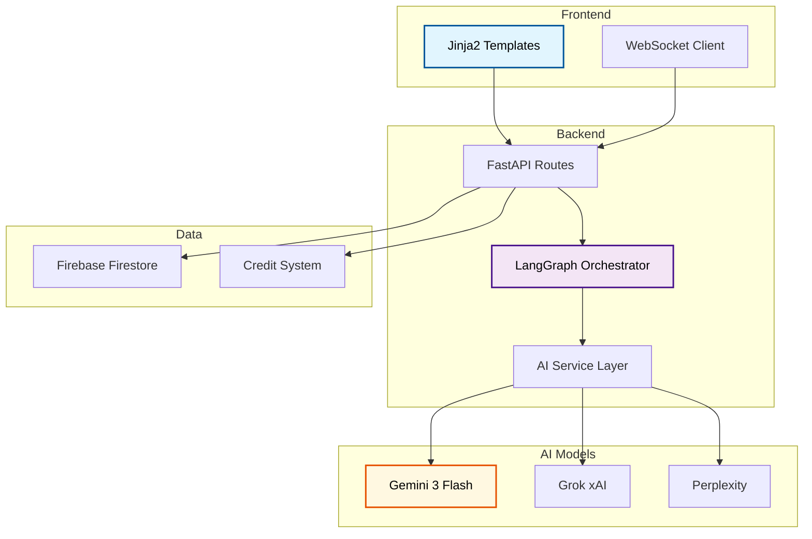

# Darom - AI-Powered News Platform

**Live Production:** [daromvibenews.com](https://daromvibenews.com)

Full-stack AI content generation platform featuring multi-agent workflows, real-time updates, and a credit-based economy.

## Technical Stack

| Component | Technology |
|-----------|------------|
| **Backend** | FastAPI, Python 3.11+, Pydantic |
| **AI/LLM** | Gemini 3 Flash, Grok, Perplexity, LangGraph |
| **Database** | Firebase Firestore |
| **Real-time** | WebSockets, Server-Sent Events |
| **Frontend** | Jinja2, JavaScript ES6 Modules |
| **Deployment** | Docker, Hetzner VPS, Caddy |

## Architecture

## Key Features

### Multi-Agent Article Generation
- LangGraph-powered agentic workflow for article creation
- Automated fact-checking with AI verification
- Multi-source research using Perplexity search
- Stateful editor with checkpoint/resume capability

### Credit Economy System
- Reserve-and-refund billing model
- Estimated cost calculation before generation
- Automatic refund on partial completion
- Token usage tracking across all AI providers

### Real-Time Communication
- WebSocket-based live updates during generation
- Server-Sent Events for progress streaming
- Community presence indicators

## Skills Demonstrated

- **AI/ML Integration:** Orchestrating multiple LLM providers with fallback strategies
- **Async Programming:** Complex async workflows with proper error handling
- **Clean Architecture:** SOLID principles with repository pattern
- **Cost Optimization:** 95% reduction through smart caching and model selection
- **Production Deployment:** Docker containerization with Caddy reverse proxy
