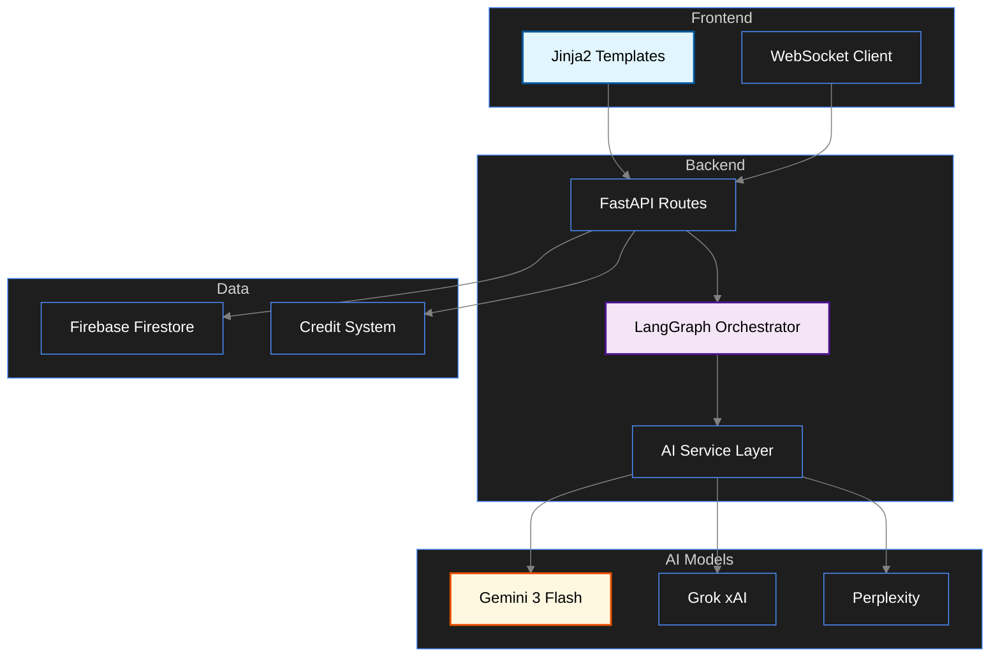

# Darom - AI-Powered News Platform

**Live Production:** [daromvibenews.com](https://daromvibenews.com)

Full-stack editorial platform: AI-assisted article workflows, real-time updates, and usage-based billing.

## Technical Stack

| Component | Technology |
|-----------|------------|
| **Backend** | FastAPI, Python 3.12+, Pydantic |
| **AI/LLM** | Gemini 3 Flash, Grok, Perplexity, LangGraph |
| **Database** | Firebase Firestore |
| **Real-time** | WebSockets, Server-Sent Events |
| **Frontend** | Jinja2, JavaScript ES6 Modules |
| **Deployment** | Docker, Hetzner VPS, Caddy |

## Architecture

```mermaid
%%{init: {'theme': 'base', 'themeVariables': {'darkMode': true, 'background': '#121212', 'primaryColor': '#1e1e1e', 'primaryTextColor': '#ffffff', 'primaryBorderColor': '#4d90fe', 'secondaryColor': '#252526', 'tertiaryColor': '#2d2d30', 'lineColor': '#808080', 'textColor': '#ffffff', 'clusterBkg': '#1e1e1e', 'clusterBorder': '#4d90fe', 'nodeTextColor': '#ffffff'}}}%%
graph TB
    subgraph "Frontend"
        A[Jinja2 Templates]
        B[WebSocket Client]
    end
    
    subgraph "Backend"
        C[FastAPI Routes]
        D[LangGraph Orchestrator]
        E[AI Service Layer]
    end
    
    subgraph "AI Models"
        F[Gemini 3 Flash]
        G[Grok xAI]
        H[Perplexity]
    end
    
    subgraph "Data"
        I[Firebase Firestore]
        J[Credit System]
    end
    
    A --> C
    B --> C
    C --> D
    D --> E
    E --> F
    E --> G
    E --> H
    C --> I
    C --> J
    
    style A fill:#e1f5fe,stroke:#01579b,stroke-width:2px,color:#000000
    style D fill:#f3e5f5,stroke:#4a148c,stroke-width:2px,color:#000000
    style F fill:#fff8e1,stroke:#e65100,stroke-width:2px,color:#000000
```

## Key Features

### Article generation and editing
- LangGraph-based workflows for drafting and revision
- Post-generation verification against sources
- Research augmented with Perplexity where configured
- Stateful editor with checkpoint-style recovery

### Usage and billing
- Reserve-and-refund style handling for generations
- Up-front estimates where applicable; partial refunds on incomplete runs
- Token usage recorded across configured providers

### Real-time UI
- WebSockets for live updates during long operations
- Server-Sent Events for progress where used
- Lightweight presence indicators on public views

## Skills Demonstrated

- **AI integration:** Multiple LLM providers with pragmatic fallbacks for availability
- **Async Programming:** Complex async workflows with proper error handling
- **Clean Architecture:** SOLID principles with repository pattern
- **Cost awareness:** Targeted caching and model selection to limit third-party API spend (e.g. social insights)
- **Production Deployment:** Docker containerization with Caddy reverse proxy
