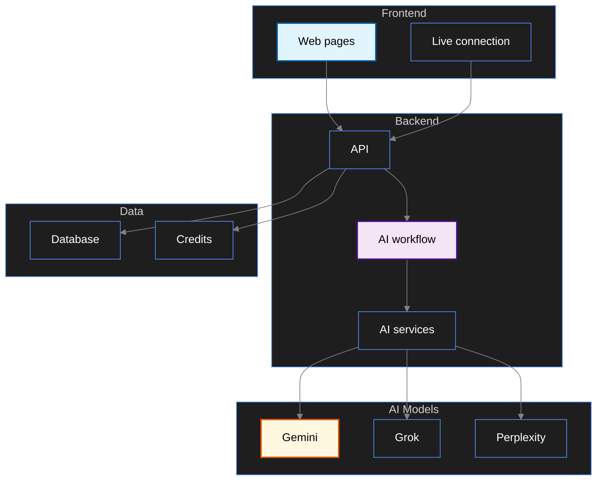

# Darom - AI-Powered News Platform

**Live Production:** [daromvibenews.com](https://daromvibenews.com)

A live news website I built and run end to end: users can write articles by hand or generate them with AI, edit with an AI assistant, and pay with a credit system. The site is online, mobile-friendly, and set up for ads.

## Technical Stack

| Area | Tools |
|------|-------|
| **Backend** | FastAPI, Python 3.12+, Pydantic |
| **AI** | Google Gemini, xAI Grok, Perplexity, LangGraph |
| **Database** | Firebase Firestore |
| **Live updates** | WebSockets, Server-Sent Events |
| **Frontend** | Jinja2 templates, modern JavaScript |
| **Payments & ads** | Stripe credits, Google AdSense |
| **Hosting** | Docker on a Hetzner VPS, Caddy |

## Architecture

```mermaid
%%{init: {'theme': 'base', 'themeVariables': {'darkMode': true, 'background': '#121212', 'primaryColor': '#1e1e1e', 'primaryTextColor': '#ffffff', 'primaryBorderColor': '#4d90fe', 'secondaryColor': '#252526', 'tertiaryColor': '#2d2d30', 'lineColor': '#808080', 'textColor': '#ffffff', 'clusterBkg': '#1e1e1e', 'clusterBorder': '#4d90fe', 'nodeTextColor': '#ffffff'}}}%%
graph TB
    subgraph "Frontend"
        A[Web pages]
        B[Live connection]
    end
    
    subgraph "Backend"
        C[API]
        D[AI workflow]
        E[AI services]
    end
    
    subgraph "AI Models"
        F[Gemini]
        G[Grok]
        H[Perplexity]
    end
    
    subgraph "Data"
        I[Database]
        J[Credits]
    end
    
    A --> C
    B --> C
    C --> D
    D --> E
    E --> F
    E --> G
    E --> H
    C --> I
    C --> J
    
    style A fill:#e1f5fe,stroke:#01579b,stroke-width:2px,color:#000000
    style D fill:#f3e5f5,stroke:#4a148c,stroke-width:2px,color:#000000
    style F fill:#fff8e1,stroke:#e65100,stroke-width:2px,color:#000000
```

## Key Features

### Writing and editing articles
- Users can write manually or ask AI to draft a normal article or a breaking-news piece
- AI can research the web, draft the story, and check facts against sources
- Built-in editor with chat: rewrite sections, mark text with instructions, and review changes before accepting them
- Version history so earlier drafts can be restored
- Clean article pages on phone and desktop (including readable tables)

### Credits and monetization
- Credit system: cost is estimated up front; unused credits are refunded when a job finishes early
- Usage is tracked across the AI providers in use
- Google AdSense is wired in (including the required ads.txt file)

### Live product experience
- Pages update live while long AI jobs run
- Connections recover cleanly after a deploy or short outage
- Mobile reading hides the header while scrolling so the article stays easy to read

## Skills Demonstrated

- **Building with AI:** Combining several AI providers in one product, with backups when one fails
- **Reliable backend work:** Async Python services with clear error handling
- **Clean code structure:** Separated business logic, data access, and UI layers
- **Product thinking:** Editor and mobile reading designed for real daily use
- **Cost control:** Caching and model choice to keep API spend down
- **Shipping to production:** Docker deploy, reverse proxy, and a public live site
