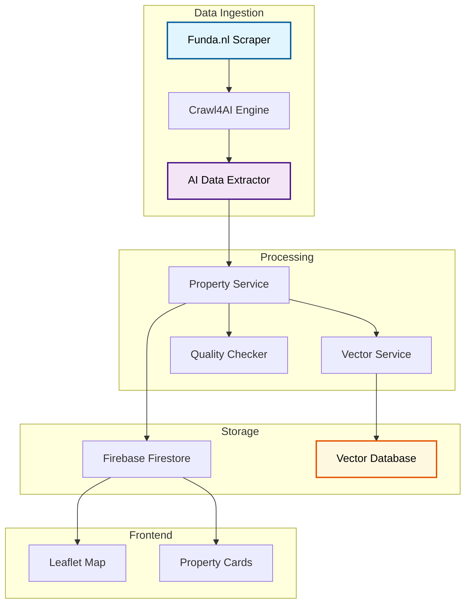

# MapsAI - Real Estate Intelligence Platform

**Live Demo:** [maps.daromvibenews.com](https://maps.daromvibenews.com)

AI-powered property visualization and analysis system with intelligent web scraping.

## Technical Stack

| Component | Technology |
|-----------|------------|
| **Backend** | FastAPI, Python 3.11+, Pydantic |
| **AI/ML** | OpenAI GPT, Crawl4AI, LangChain |
| **Database** | Firebase Firestore, Vector Embeddings |
| **Scraping** | Crawl4AI, Playwright, BeautifulSoup |
| **Frontend** | Jinja2, Leaflet.js, JavaScript |
| **Deployment** | Docker, Hetzner VPS |

## Architecture

## Key Features

### AI-Powered Web Scraping
- LLM-based data extraction from unstructured HTML
- Automatic schema inference for property data
- Captcha detection and human-intervention workflow
- Cookie persistence for session management

### Interactive Mapping
- Leaflet.js integration with property clustering
- Real-time filter updates
- Property detail overlays with AI insights

### Vector Search
- OpenAI embeddings for property descriptions
- Semantic similarity search
- "Find similar properties" functionality

### Data Quality Management
- Automated health checks for property data
- Zombie property detection
- Incomplete data flagging

## Skills Demonstrated

- **Web Scraping:** Advanced techniques with bot detection evasion
- **Vector Databases:** Semantic search implementation
- **Clean Architecture:** Interface-based dependency injection
- **Data Quality:** Automated validation and monitoring
- **Frontend Integration:** Interactive mapping with real-time updates
