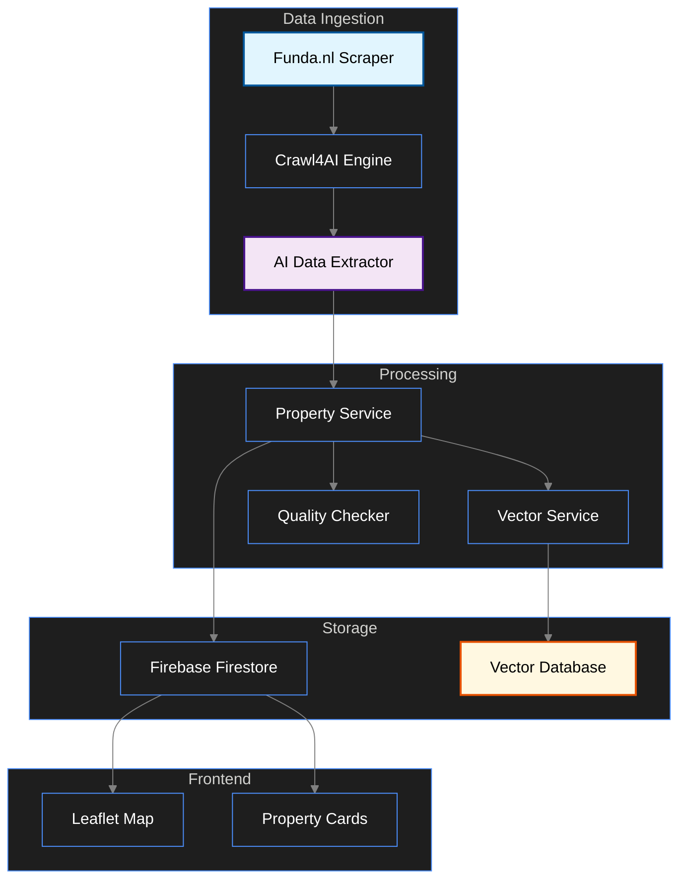

# MapsAI - Real Estate Intelligence Platform

**Live:** [maps.daromvibenews.com](https://maps.daromvibenews.com)

Web application for Dutch property listings: ingestion, structured storage, map UI, and semantic search.

## Technical Stack

| Component | Technology |
|-----------|------------|
| **Backend** | FastAPI, Python 3.12+, Pydantic |
| **AI / automation** | OpenAI APIs, Crawl4AI, LangChain, LangGraph |
| **Database** | Firebase Firestore, Vector Embeddings |
| **Scraping** | Crawl4AI, Playwright, BeautifulSoup |
| **Frontend** | Jinja2, Leaflet.js, JavaScript |
| **Deployment** | Docker, Hetzner VPS, Caddy |

## Architecture

```mermaid
%%{init: {'theme': 'base', 'themeVariables': {'darkMode': true, 'background': '#121212', 'primaryColor': '#1e1e1e', 'primaryTextColor': '#ffffff', 'primaryBorderColor': '#4d90fe', 'secondaryColor': '#252526', 'tertiaryColor': '#2d2d30', 'lineColor': '#808080', 'textColor': '#ffffff', 'clusterBkg': '#1e1e1e', 'clusterBorder': '#4d90fe', 'nodeTextColor': '#ffffff'}}}%%
graph TB
    subgraph "Data Ingestion"
        A[Funda.nl Scraper]
        B[Crawl4AI Engine]
        C[AI Data Extractor]
    end
    
    subgraph "Processing"
        D[Property Service]
        E[Vector Service]
        F[Quality Checker]
    end
    
    subgraph "Storage"
        G[Firebase Firestore]
        H[Vector Database]
    end
    
    subgraph "Frontend"
        I[Leaflet Map]
        J[Property Cards]
    end
    
    A --> B
    B --> C
    C --> D
    D --> E
    D --> F
    E --> H
    D --> G
    G --> I
    G --> J
    
    style A fill:#e1f5fe,stroke:#01579b,stroke-width:2px,color:#000000
    style C fill:#f3e5f5,stroke:#4a148c,stroke-width:2px,color:#000000
    style H fill:#fff8e1,stroke:#e65100,stroke-width:2px,color:#000000
```

## Key features

### Ingestion and extraction
- Crawl4AI / Playwright-backed scraping of listing sites
- LLM-assisted parsing of unstructured HTML into structured fields
- Session handling and basic guardrails for unstable pages

### Map and UX
- Leaflet map with clustering and filters
- Viewport-oriented loading to limit payload size

### Search and quality
- Embeddings for similarity-style queries where enabled
- Health checks and flags for stale or incomplete records

## Skills demonstrated

- **Data ingestion:** Browser automation and resilient scraping patterns
- **Search:** Embedding-backed similarity over property text
- **Architecture:** Layered FastAPI services with injectable dependencies
- **Operations:** Containerized deployment behind a reverse proxy
