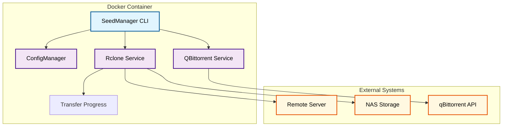
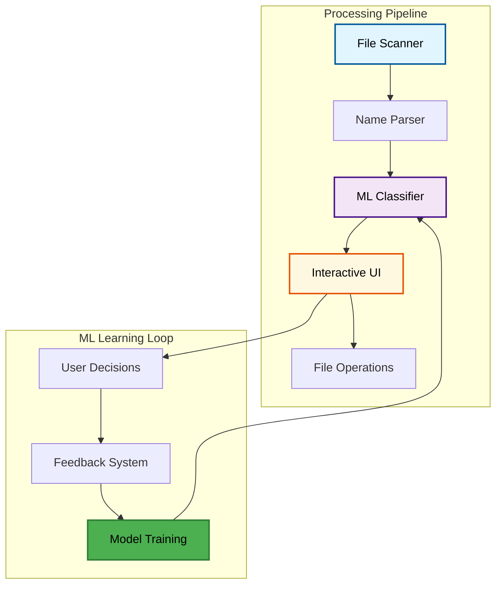

# Media Automation Suite

Docker-based automation tools for managing media file transfers and organization on NAS systems.

## Table of Contents
- [Overview](#overview)
- [Technical Stack](#technical-stack)
- [Architecture](#architecture)
- [Key Features](#key-features)
- [Skills Demonstrated](#skills-demonstrated)

## Overview

A collection of two Python applications designed to automate media file management workflows. The suite handles file transfers between servers with progress tracking, and intelligent file organization with ML-powered classification.

---

## 📋 Technical Stack

| Category | Technologies |
|----------|-------------|
| **Language** | Python 3.10+ |
| **Containerization** | Docker, Docker Compose |
| **File Transfer** | rclone, SFTP |
| **API Integration** | qBittorrent WebAPI |
| **ML/Classification** | Scikit-learn patterns, Custom ML classifier |
| **CLI Interface** | Rich Console, ASCII progress bars |
| **Testing** | pytest, Integration tests |
| **Logging** | Structured logging, JSON output |

---

## 🔧 Architecture

### SeedManager - File Transfer Automation

### File Manager - ML-Powered Organization

---

## Key Features

### SeedManager

**File Transfer System:**
- Automated file transfers with rclone integration
- Real-time progress display with ASCII art progress bars
- File integrity verification with size checking
- Stall detection and automatic retry logic
- Dynamic path mapping between systems
- Configurable criteria for transfer eligibility

**qBittorrent Integration:**
- Full WebAPI integration with authentication
- State analysis and eligibility checking
- Automatic cleanup after successful transfers

### File Manager

**Smart Classification:**
- Advanced regex-based filename parsing
- ML-powered auto-approval based on confidence scoring
- Learns from user decisions to improve accuracy
- Quality indicator recognition for trusted sources

**Interactive Interface:**
- Rich terminal UI with bulk operations
- Dry-run mode for safe previewing
- Category-based review workflow
- Smart recommendations with explanations

**Media Organization:**
- Plex-compatible directory structure
- Automatic subtitle file handling
- Support for movies, TV shows, and music

---

## Skills Demonstrated

**Software Architecture:**
- Clean service-oriented architecture
- Strategy pattern for transfer operations
- Observer pattern for progress tracking
- Data classes for transfer requests/results

**DevOps & Automation:**
- Docker containerization with Docker Compose
- Scheduled task automation (NAS Task Scheduler)
- Environment-based configuration
- Comprehensive logging systems

**API Integration:**
- qBittorrent WebAPI client implementation
- rclone command integration
- JSON-based configuration management

**Machine Learning:**
- Custom classifier with confidence scoring
- User feedback loop for continuous learning
- Feature extraction from filenames
- Pattern recognition for quality indicators

**Testing & Quality:**
- Integration tests with real connections
- Unit tests with mocked dependencies
- Test runner automation
