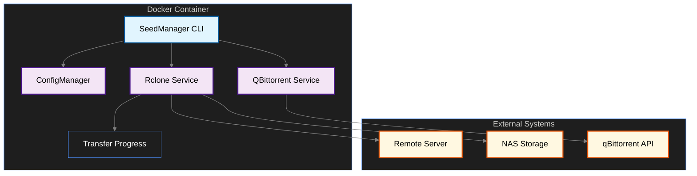
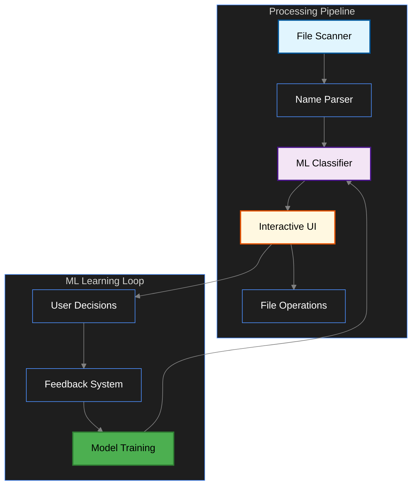

# Media Automation Suite

Docker-packaged Python tools for server-to-NAS media transfers and semi-automated file organization.

## Technical stack

| Category | Technologies |
|----------|-------------|
| **Language** | Python 3.10+ |
| **Containers** | Docker, Docker Compose |
| **Transfer** | rclone, SFTP |
| **APIs** | qBittorrent Web API |
| **Classification** | Lightweight ML / heuristics on filenames and metadata |
| **CLI** | Rich, structured logging |
| **Testing** | pytest (unit and integration-style) |

## Architecture

### SeedManager — transfers

```mermaid
%%{init: {'theme': 'base', 'themeVariables': {'darkMode': true, 'background': '#121212', 'primaryColor': '#1e1e1e', 'primaryTextColor': '#ffffff', 'primaryBorderColor': '#4d90fe', 'secondaryColor': '#252526', 'tertiaryColor': '#2d2d30', 'lineColor': '#808080', 'textColor': '#ffffff', 'clusterBkg': '#1e1e1e', 'clusterBorder': '#4d90fe', 'nodeTextColor': '#ffffff'}}}%%
graph TB
    subgraph "Docker Container"
        A[SeedManager CLI] --> B[ConfigManager]
        A --> C[QBittorrent Service]
        A --> D[Rclone Service]
        D --> E[Transfer Progress]
    end
    
    subgraph "External Systems"
        F[Remote Server]
        G[NAS Storage]
        H[qBittorrent API]
    end
    
    C --> H
    D --> F
    D --> G
    
    style A fill:#e1f5fe,stroke:#01579b,stroke-width:2px,color:#000000
    style B fill:#f3e5f5,stroke:#4a148c,stroke-width:2px,color:#000000
    style C fill:#f3e5f5,stroke:#4a148c,stroke-width:2px,color:#000000
    style D fill:#f3e5f5,stroke:#4a148c,stroke-width:2px,color:#000000
    style F fill:#fff8e1,stroke:#e65100,stroke-width:2px,color:#000000
    style G fill:#fff8e1,stroke:#e65100,stroke-width:2px,color:#000000
    style H fill:#fff8e1,stroke:#e65100,stroke-width:2px,color:#000000
```

### File Manager — organization

```mermaid
%%{init: {'theme': 'base', 'themeVariables': {'darkMode': true, 'background': '#121212', 'primaryColor': '#1e1e1e', 'primaryTextColor': '#ffffff', 'primaryBorderColor': '#4d90fe', 'secondaryColor': '#252526', 'tertiaryColor': '#2d2d30', 'lineColor': '#808080', 'textColor': '#ffffff', 'clusterBkg': '#1e1e1e', 'clusterBorder': '#4d90fe', 'nodeTextColor': '#ffffff'}}}%%
graph TB
    subgraph "Processing Pipeline"
        A[File Scanner] --> B[Name Parser]
        B --> C[ML Classifier]
        C --> D[Interactive UI]
        D --> E[File Operations]
    end
    
    subgraph "ML Learning Loop"
        F[User Decisions]
        G[Feedback System]
        H[Model Training]
    end
    
    D --> F
    F --> G
    G --> H
    H --> C
    
    style A fill:#e1f5fe,stroke:#01579b,stroke-width:2px,color:#000000
    style C fill:#f3e5f5,stroke:#4a148c,stroke-width:2px,color:#000000
    style D fill:#fff8e1,stroke:#e65100,stroke-width:2px,color:#000000
    style H fill:#4caf50,stroke:#2e7d32,stroke-width:2px,color:#000000
```

## Key features

### SeedManager
- rclone-driven copies with progress and integrity checks
- Stall detection and retries on long transfers
- qBittorrent Web API integration for eligibility and cleanup

### File Manager
- Filename parsing and confidence-scored suggestions
- User feedback loop to improve suggestions over time
- Dry-run and bulk operations in the terminal
- Layout conventions compatible with common media servers (e.g. Plex)

## Skills demonstrated

- **Reliability:** Long-running jobs with observable progress and failure handling
- **Integration:** Wrapping CLI tools and HTTP APIs behind small service layers
- **Packaging:** Repeatable Docker images for home-lab style deployments
- **Testing:** Mix of mocked unit tests and integration-style checks
