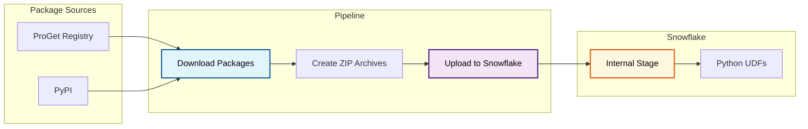

# Snowflake Package Sync Pipeline

Enterprise CI/CD pipeline for synchronizing Python packages to Snowflake internal stages.

## Technical Stack

| Component | Technology |
|-----------|------------|
| **Language** | Python 3.x |
| **Data Platform** | Snowflake |
| **CI/CD** | Azure DevOps, Azure Pipelines |
| **Package Sources** | ProGet, PyPI |
| **Testing** | pytest, unittest.mock |

## Architecture

## Key Features

### Automated Package Management
- Downloads packages from corporate ProGet or public PyPI
- Creates Snowflake-compatible ZIP archives
- Handles dependency resolution

### Azure DevOps Integration
- Fully automated pipeline triggers
- Environment-specific configurations
- Secure credential management via Azure Key Vault

### Testing Strategy
- Unit tests with mocked external dependencies
- Integration tests against Snowflake staging
- CI validation on pull requests

## Skills Demonstrated

- **Data Engineering:** Snowflake administration and Python UDF deployment
- **CI/CD:** Azure DevOps pipeline design and automation
- **Python Packaging:** Understanding of wheel formats and dependencies
- **Enterprise Integration:** Working with corporate package registries
