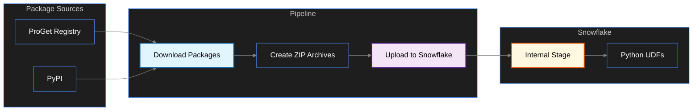

# Snowflake Package Sync Pipeline

Internal-style CI/CD flow for packaging Python dependencies and publishing them to Snowflake stages for UDFs and notebooks.

## Technical Stack

| Component | Technology |
|-----------|------------|
| **Language** | Python 3.x |
| **Data Platform** | Snowflake |
| **CI/CD** | Azure DevOps, Azure Pipelines |
| **Package Sources** | ProGet, PyPI |
| **Testing** | pytest, unittest.mock |

## Architecture

```mermaid
%%{init: {'theme': 'base', 'themeVariables': {'darkMode': true, 'background': '#121212', 'primaryColor': '#1e1e1e', 'primaryTextColor': '#ffffff', 'primaryBorderColor': '#4d90fe', 'secondaryColor': '#252526', 'tertiaryColor': '#2d2d30', 'lineColor': '#808080', 'textColor': '#ffffff', 'clusterBkg': '#1e1e1e', 'clusterBorder': '#4d90fe', 'nodeTextColor': '#ffffff'}}}%%
graph LR
    subgraph "Package Sources"
        A[ProGet Registry]
        B[PyPI]
    end
    
    subgraph "Pipeline"
        C[Download Packages]
        D[Create ZIP Archives]
        E[Upload to Snowflake]
    end
    
    subgraph "Snowflake"
        F[Internal Stage]
        G[Python UDFs]
    end
    
    A --> C
    B --> C
    C --> D
    D --> E
    E --> F
    F --> G
    
    style C fill:#e1f5fe,stroke:#01579b,stroke-width:2px,color:#000000
    style E fill:#f3e5f5,stroke:#4a148c,stroke-width:2px,color:#000000
    style F fill:#fff8e1,stroke:#e65100,stroke-width:2px,color:#000000
```

## Key Features

### Package flow
- Download from corporate ProGet and/or public PyPI as configured
- Produce Snowflake-compatible ZIP bundles for internal stages
- Resolve or pin dependencies according to pipeline rules

### Azure DevOps integration
- Pipeline-triggered builds and uploads
- Environment-specific variables for Snowflake and registry access
- Credentials supplied via pipeline secrets / variables (not committed to the repo)

### Testing
- Unit tests with mocked external I/O
- Targeted checks against Snowflake staging where available
- CI runs on pull requests

## Skills demonstrated

- **Data platforms:** Snowflake stages and Python artifact layout for in-warehouse use
- **CI/CD:** Azure Pipelines wiring for repeatable uploads
- **Packaging:** Wheels, ZIP layouts, and dependency constraints in a regulated context
- **Registries:** Consumption from private (ProGet) and public indexes
