# Systemic Lag Trader — BTC / prediction-market agent

**Dashboard:** [btc.daromvibenews.com](https://btc.daromvibenews.com)

*Experimental system—not financial advice; intended for research and controlled environments.*

Pipeline that looks for **systemic lag** between fast headlines (social / RSS) and slower wire-style confirmation: staged LLM passes reduce noise, estimate short-horizon edge using live crypto context, then apply risk rules before any optional execution (Polymarket path; dry-run by default).

## Technical Stack

| Component | Technology |
|-----------|------------|
| **Backend** | FastAPI, Python 3.12+, Pydantic Settings |
| **Orchestration** | LangGraph (`StateGraph`), scheduled multi-agent cycles |
| **AI / LLM** | xAI Grok (discovery), Perplexity (verification), Google Gemini (edge / regime) |
| **Market data** | CoinGecko (BTC/ETH/SOL context), Polymarket CLOB/Gamma |
| **Persistence** | Firebase Firestore (production audits), JSONL signal memory & trade logs |
| **Frontend** | Dashboard UI with WebSocket live updates |
| **Deployment** | Docker on VPS; TLS and routing via Caddy |

## Architecture (inverted pyramid)

Same flow as the public [About](https://btc.daromvibenews.com/about) page (rendered from the app’s `/about` template).

```mermaid
%%{init: {'theme': 'base', 'flowchart': {'nodeSpacing': 80, 'rankSpacing': 80, 'curve': 'basis'}, 'themeVariables': {'darkMode': true, 'background': '#121212', 'primaryColor': '#1e1e1e', 'primaryTextColor': '#ffffff', 'primaryBorderColor': '#4d90fe', 'secondaryColor': '#252526', 'tertiaryColor': '#2d2d30', 'lineColor': '#808080', 'textColor': '#ffffff', 'clusterBkg': '#1e1e1e', 'clusterBorder': '#4d90fe', 'nodeTextColor': '#ffffff', 'fontFamily': 'Segoe UI, sans-serif'}}}%%
flowchart TD
    subgraph Discovery ["1. DISCOVERY (High Throughput)"]
        SM[Signal Memory] -- "Pending headlines" --> S[Signal Pool]
        G[xAI Grok] -- "Twitter Firehose" --> S
        R[RSS Feeds] -- "Institutional News" --> S
        S -- "Save new" --> SM
    end

    subgraph Verification ["2. VERIFICATION (Truth Filtering)"]
        S -- "Headline" --> P[Perplexity AI]
        P -- "Search Web" --> V{Is Verified?}
    end

    subgraph Analysis ["3. EDGE ANALYSIS (Alpha Estimation)"]
        V -- "Yes" --> GM[Google Gemini]
        C[CoinGecko] -- "Live Prices" --> GM
        GM -- "Compare News vs Price" --> E[Edge Score]
    end

    subgraph Execution ["4. ACTION (Risk-Managed)"]
        E -- "> Threshold" --> B[Portfolio Expert]
        B -- "Check Balance" --> BT[Bandit Tuner]
        BT -- "Select Arm" --> PM[Polymarket]
        PM -- "Outcome" --> BK[Backfill Service]
        BK -- "Realized PnL" --> BT
    end

    style Discovery fill:#1e1e1e,stroke:#4d90fe,stroke-width:2px
    style Verification fill:#1e1e1e,stroke:#4d90fe,stroke-width:2px
    style Analysis fill:#1e1e1e,stroke:#4d90fe,stroke-width:2px
    style Execution fill:#1e1e1e,stroke:#4d90fe,stroke-width:2px
    style PM fill:#4d90fe,stroke:#ffffff,stroke-width:2px,color:#000
```

## Key features

### Pipeline
- Discovery via Grok and RSS; short retention of pending headlines for later re-checks.
- Verification pass (e.g. Perplexity) against secondary sources.
- Edge estimation with Gemini using BTC/ETH/SOL context from CoinGecko.

### Risk and feedback
- Position sizing caps, daily loss context, and explicit exit / panic rules.
- Optional hibernation when markets are quiet to limit API use.
- Outcome backfill to tune a contextual bandit and regret-style cutoffs.

### Operations
- Scheduled cycles plus manual `POST /run-once`; dashboard with WebSocket metrics for monitoring.

## Skills demonstrated

- **Orchestration:** LangGraph graphs that merge persisted signals with fresh feeds.
- **LLM boundaries:** Separate stages for breadth vs. verification vs. decision support.
- **Observability:** Structured logs, optional Firestore audit trail, containerized deployment.
- **Decision hygiene:** Bandit-style exploration with explicit risk and regime hooks—not always-on trading.
