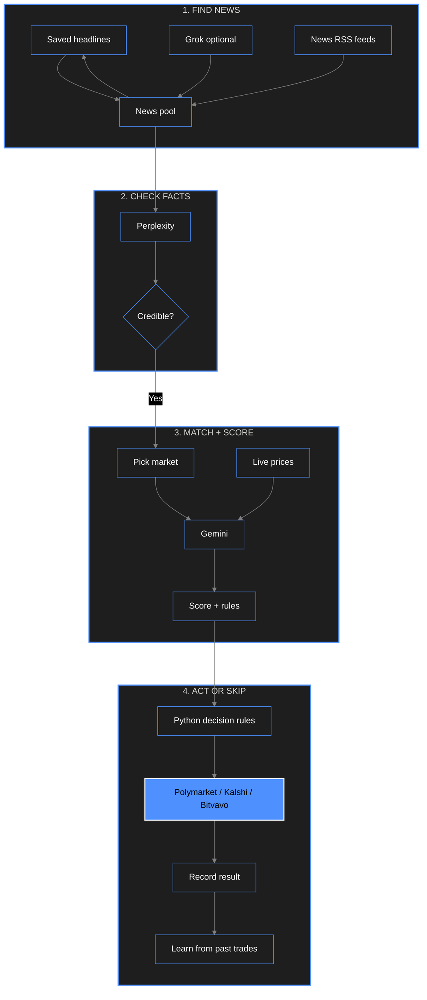

# Systemic Lag Trader — AI Bitcoin trading research bot

**Live dashboard:** [btc.daromvibenews.com](https://btc.daromvibenews.com)

*Research project only — not financial advice. Runs in paper (simulated) mode by default.*

An automated system that watches Bitcoin-related news, checks whether stories are real, picks a matching prediction-market contract, and decides whether a paper trade makes sense — using AI for reading and scoring, and normal Python rules for risk and “do we actually trade?”

**Idea in one line:** news often moves faster than markets; the bot looks for that delay, then only acts when checks pass.

**Today (Jul 2026):** live on a VPS in **paper trading** on [Polymarket](https://polymarket.com) using real public prices (no real money until results look consistently good). The same app can also talk to Kalshi and European crypto spot (Bitvavo) for other coins.

## Technical Stack

| Area | Tools |
|------|-------|
| **Backend** | FastAPI, Python 3.12+, Pydantic |
| **AI workflow** | LangGraph (multi-step agent pipeline) |
| **AI models** | Grok (optional news find), Perplexity (fact-check), Google Gemini (pick market + score opportunity) |
| **Market data** | CoinGecko, Polymarket, Kalshi (optional), Bitvavo (optional) |
| **Search / memory** | Supabase vector search (optional), Firebase, Postgres, local log files |
| **Dashboard** | Jinja2 web UI with live price updates |
| **Hosting** | Docker on a VPS, Caddy for HTTPS |

## How it works

Same story as the public [About](https://btc.daromvibenews.com/about) page.

```mermaid
%%{init: {'theme': 'base', 'flowchart': {'nodeSpacing': 80, 'rankSpacing': 80, 'curve': 'basis'}, 'themeVariables': {'darkMode': true, 'background': '#121212', 'primaryColor': '#1e1e1e', 'primaryTextColor': '#ffffff', 'primaryBorderColor': '#4d90fe', 'secondaryColor': '#252526', 'tertiaryColor': '#2d2d30', 'lineColor': '#808080', 'textColor': '#ffffff', 'clusterBkg': '#1e1e1e', 'clusterBorder': '#4d90fe', 'nodeTextColor': '#ffffff', 'fontFamily': 'Segoe UI, sans-serif'}}}%%
flowchart TD
    subgraph Discovery ["1. FIND NEWS"]
        SM[Saved headlines] --> S[News pool]
        G[Grok optional] --> S
        R[News RSS feeds] --> S
        S --> SM
    end

    subgraph Verification ["2. CHECK FACTS"]
        S --> P[Perplexity]
        P --> V{Credible?}
    end

    subgraph Analysis ["3. MATCH + SCORE"]
        V -- Yes --> RT[Pick market]
        RT --> GM[Gemini]
        C[Live prices] --> GM
        GM --> E[Score + rules]
    end

    subgraph Execution ["4. ACT OR SKIP"]
        E --> DS[Python decision rules]
        DS --> VN[Polymarket / Kalshi / Bitvavo]
        VN --> BK[Record result]
        BK --> MEM[Learn from past trades]
    end

    style Discovery fill:#1e1e1e,stroke:#4d90fe,stroke-width:2px
    style Verification fill:#1e1e1e,stroke:#4d90fe,stroke-width:2px
    style Analysis fill:#1e1e1e,stroke:#4d90fe,stroke-width:2px
    style Execution fill:#1e1e1e,stroke:#4d90fe,stroke-width:2px
    style VN fill:#4d90fe,stroke:#ffffff,stroke-width:2px,color:#000
```

## What I built

### The trading loop
- Pulls news from RSS (and optionally Grok), remembers unfinished stories, and can wake up when something new appears
- Fact-checks with Perplexity before spending time on market matching
- Uses Gemini to pick the right contract and score whether there is a real opportunity
- Final go/no-go is **Python rules**, not “the model said buy” — every skip has a clear reason

### Safety and control
- Paper trading first; live trading is an explicit switch
- Hard limits: confidence floors, cooldown between orders, max open positions per market
- Prefers fewer careful trades over many weak ones
- Can hold several markets at once, with a cap per market

### Markets and ops
- Primary path: Polymarket paper trading on real public prices
- Same codebase supports Kalshi and Bitvavo spot workers
- Separate API and worker services so the dashboard stays responsive while the bot runs
- Operator dashboard: live prices, P&L, recent orders, why trades were skipped, live config
- Deployed with Docker and a simple deploy script; automated smoke checks after deploy
- Unit tests around decisions, dashboard data, and market adapters

## Skills this shows

- **AI systems in production:** several models in one pipeline, with cost and reliability in mind
- **Clear boundaries:** AI for language and scoring; Python for risk and execution rules
- **Full-stack delivery:** API, background workers, dashboard, deploy, and monitoring
- **Data & ops:** logs, paper ledger, optional databases for longer-term memory
- **Engineering discipline:** tests and explicit skip reasons so behavior stays explainable
