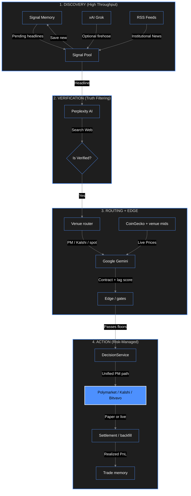

# Systemic Lag Trader — BTC / prediction-market agent

**Dashboard:** [btc.daromvibenews.com](https://btc.daromvibenews.com)

*Experimental system—not financial advice; intended for research and controlled environments.*

Pipeline that looks for **systemic lag** between fast headlines (RSS / optional social discovery) and slower wire-style confirmation: staged LLM passes reduce noise, route a verified story to a venue contract, estimate short-horizon edge against live prices, then apply explicit **Python risk gates** before **paper-simulated** or optional live execution.

**Production (Jul 2026):** **Polymarket-first** paper trading on real Gamma/CLOB YES mids (`SYSTEMIC_LAG_LIVE_VENUE=polymarket`, live flag off until paper expectancy is green). Optional **Kalshi** binary markets and **Bitvavo** EUR spot sidecars (ETH/SOL / BTC spot) remain in the same codebase. Multiple open markets are allowed; per-market open-leg caps apply.

## Technical Stack

| Component | Technology |
|-----------|------------|
| **Backend** | FastAPI, Python 3.12+, Pydantic Settings |
| **Orchestration** | LangGraph (`StateGraph`), API vs worker process split, scheduled cycles, RSS novelty triggers, async price + matching loop |
| **AI / LLM** | xAI Grok (optional discovery), Perplexity Sonar (verification), Google Gemini (market match, edge, optional manager JSON) |
| **Market data** | CoinGecko (BTC/ETH/SOL), Polymarket Gamma/CLOB (YES mids), Kalshi public REST (optional), Bitvavo public tickers + FX (spot sidecars) |
| **Matching / RAG** | Optional Supabase **pgvector** embeddings for Polymarket / Kalshi contract search |
| **Persistence** | Firebase Firestore (audits / trade memory), local JSONL audits & signal memory, file-backed paper ledgers, optional Postgres news intelligence |
| **Frontend** | Operator dashboard (Jinja2) with WebSocket live prices, paper-contract economics, order insights, and **runtime config snapshot** |
| **Deployment** | Docker Compose on VPS (API + worker + optional coin sidecars); rsync deploy; TLS via Caddy |

## Architecture (inverted pyramid)

Same high-level flow as the public [About](https://btc.daromvibenews.com/about) page (rendered from the app’s `/about` template).

```mermaid
%%{init: {'theme': 'base', 'flowchart': {'nodeSpacing': 80, 'rankSpacing': 80, 'curve': 'basis'}, 'themeVariables': {'darkMode': true, 'background': '#121212', 'primaryColor': '#1e1e1e', 'primaryTextColor': '#ffffff', 'primaryBorderColor': '#4d90fe', 'secondaryColor': '#252526', 'tertiaryColor': '#2d2d30', 'lineColor': '#808080', 'textColor': '#ffffff', 'clusterBkg': '#1e1e1e', 'clusterBorder': '#4d90fe', 'nodeTextColor': '#ffffff', 'fontFamily': 'Segoe UI, sans-serif'}}}%%
flowchart TD
    subgraph Discovery ["1. DISCOVERY (High Throughput)"]
        SM[Signal Memory] -- "Pending headlines" --> S[Signal Pool]
        G[xAI Grok] -- "Optional firehose" --> S
        R[RSS Feeds] -- "Institutional News" --> S
        S -- "Save new" --> SM
    end

    subgraph Verification ["2. VERIFICATION (Truth Filtering)"]
        S -- "Headline" --> P[Perplexity AI]
        P -- "Search Web" --> V{Is Verified?}
    end

    subgraph Analysis ["3. ROUTING + EDGE"]
        V -- "Yes" --> RT[Venue router]
        RT -- "PM / Kalshi / spot" --> GM[Google Gemini]
        C[CoinGecko + venue mids] -- "Live Prices" --> GM
        GM -- "Contract + lag score" --> E[Edge / gates]
    end

    subgraph Execution ["4. ACTION (Risk-Managed)"]
        E -- "Passes floors" --> DS[DecisionService]
        DS -- "Unified PM path" --> VN[Polymarket / Kalshi / Bitvavo]
        VN -- "Paper or live" --> BK[Settlement / backfill]
        BK -- "Realized PnL" --> MEM[Trade memory]
    end

    style Discovery fill:#1e1e1e,stroke:#4d90fe,stroke-width:2px
    style Verification fill:#1e1e1e,stroke:#4d90fe,stroke-width:2px
    style Analysis fill:#1e1e1e,stroke:#4d90fe,stroke-width:2px
    style Execution fill:#1e1e1e,stroke:#4d90fe,stroke-width:2px
    style VN fill:#4d90fe,stroke:#ffffff,stroke-width:2px,color:#000
```

## Key features

### Pipeline
- **RSS-first discovery** with optional Grok; signal memory and RSS novelty triggers for delayed / burst re-checks (cost-aware `skip_grok` on many cycles).
- Perplexity verification with batched cache + configurable top-N; event dedup before expensive market matching.
- Venue routing: Polymarket condition ids (Gamma + RAG + Gemini), optional Kalshi open-market / bet-slate routing, Bitvavo spot for sidecars.
- Gemini edge (+ optional manager veto / gate tighten / size scale) then **DecisionService** with structured skip reasons.

### Risk, modes, and decisions
- Env-driven **normal / riskier** profiles and explicit Python floors (edge, confidence, token YES-mid bands, cooldowns).
- Polymarket **unified execution** with causal fitness, ATM state routing, and regime gates (prefer fewer defensible orders over raw volume).
- Concurrent multi-market positions allowed; per-market open-leg caps.
- Optional contextual bandit, volatility-spaced AI cycles, spike / fast-move triggers (usually cost-gated off).

### Market integration
- **Polymarket** primary paper venue on production: public YES mids, Gamma settlement backfill, authoritative paper ledger economics.
- **Kalshi** and **Bitvavo** remain pluggable via `SYSTEMIC_LAG_LIVE_VENUE` and parallel Docker workers.
- Paper portfolio: queued limits, matching against live public books, settlement events as ledger truth.

### Operations
- **API vs worker** containers: dashboard / ready on API; autonomous cycles on worker.
- Dual cadence: long AI cycle plus frequent **price + matching** loop; optional RSS novelty–triggered cycles.
- Operator dashboard: WebSocket prices, paper-contract economics, order insights / alignment, skip taxonomy, live **runtime config**.
- Deploy: Docker Compose + scripted rsync; layered VPS env overlays; post-deploy HTTP smoke.

### Quality & memory
- **pytest** coverage on decision logic, dashboard API, venue parsing, and infrastructure paths.
- Optional **trade memory** (Firestore) and **news intelligence** (Postgres) for durable case context across cycles.

## Skills demonstrated

- **Orchestration:** LangGraph plus real-world scheduling (intervals, novelty triggers, cost controls, process role split).
- **LLM boundaries:** Discovery vs verification vs routing/scoring vs pure **Python** decision gates.
- **Multi-venue adapters:** Prediction markets and spot under one gateway / ledger model.
- **Observability:** Structured audits, ledger economics, operator dashboard contract.
- **Reliability:** Defensive price parsing, explicit skip reasons, tests as regression guardrails—not “LLM says trade.”
