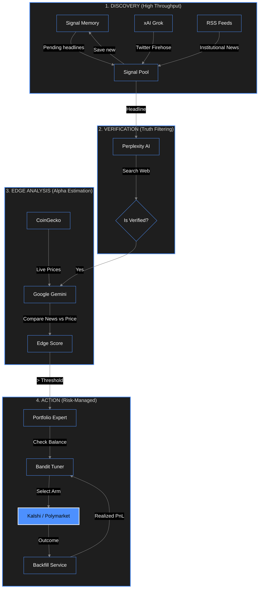

# Systemic Lag Trader — BTC / prediction-market agent

**Dashboard:** [btc.daromvibenews.com](https://btc.daromvibenews.com)

*Experimental system—not financial advice; intended for research and controlled environments.*

Pipeline that looks for **systemic lag** between fast headlines (social / RSS) and slower wire-style confirmation: staged LLM passes reduce noise, estimate short-horizon edge using live market context, then apply risk rules before **paper-simulated** or optional live execution (**Kalshi**-first venue in production; Polymarket path retained; dry-run by default).

## Technical Stack

| Component | Technology |
|-----------|------------|
| **Backend** | FastAPI, Python 3.12+, Pydantic Settings |
| **Orchestration** | LangGraph (`StateGraph`), scheduled multi-agent cycles, async price + matching loop |
| **AI / LLM** | xAI Grok (discovery), Perplexity (verification), Google Gemini (edge / regime) |
| **Market data** | CoinGecko (BTC/ETH/SOL), Kalshi public market API (binary YES mids), Polymarket CLOB/Gamma (alternate path) |
| **Matching / RAG** | Optional Supabase **pgvector** embeddings for Kalshi ticker search |
| **Persistence** | Firebase Firestore (audits), JSONL signal memory & local trade logs, file-backed paper portfolio |
| **Frontend** | Operator dashboard (Jinja2) with WebSocket live prices and **runtime config snapshot** |
| **Deployment** | Docker on VPS; rsync deploy script; TLS via Caddy |

## Architecture (inverted pyramid)

Same flow as the public [About](https://btc.daromvibenews.com/about) page (rendered from the app’s `/about` template).

```mermaid
%%{init: {'theme': 'base', 'flowchart': {'nodeSpacing': 80, 'rankSpacing': 80, 'curve': 'basis'}, 'themeVariables': {'darkMode': true, 'background': '#121212', 'primaryColor': '#1e1e1e', 'primaryTextColor': '#ffffff', 'primaryBorderColor': '#4d90fe', 'secondaryColor': '#252526', 'tertiaryColor': '#2d2d30', 'lineColor': '#808080', 'textColor': '#ffffff', 'clusterBkg': '#1e1e1e', 'clusterBorder': '#4d90fe', 'nodeTextColor': '#ffffff', 'fontFamily': 'Segoe UI, sans-serif'}}}%%
flowchart TD
    subgraph Discovery ["1. DISCOVERY (High Throughput)"]
        SM[Signal Memory] -- "Pending headlines" --> S[Signal Pool]
        G[xAI Grok] -- "Twitter Firehose" --> S
        R[RSS Feeds] -- "Institutional News" --> S
        S -- "Save new" --> SM
    end

    subgraph Verification ["2. VERIFICATION (Truth Filtering)"]
        S -- "Headline" --> P[Perplexity AI]
        P -- "Search Web" --> V{Is Verified?}
    end

    subgraph Analysis ["3. EDGE ANALYSIS (Alpha Estimation)"]
        V -- "Yes" --> GM[Google Gemini]
        C[CoinGecko] -- "Live Prices" --> GM
        GM -- "Compare News vs Price" --> E[Edge Score]
    end

    subgraph Execution ["4. ACTION (Risk-Managed)"]
        E -- "> Threshold" --> B[Portfolio Expert]
        B -- "Check Balance" --> BT[Bandit Tuner]
        BT -- "Select Arm" --> VN[Kalshi / Polymarket]
        VN -- "Outcome" --> BK[Backfill Service]
        BK -- "Realized PnL" --> BT
    end

    style Discovery fill:#1e1e1e,stroke:#4d90fe,stroke-width:2px
    style Verification fill:#1e1e1e,stroke:#4d90fe,stroke-width:2px
    style Analysis fill:#1e1e1e,stroke:#4d90fe,stroke-width:2px
    style Execution fill:#1e1e1e,stroke:#4d90fe,stroke-width:2px
    style VN fill:#4d90fe,stroke:#ffffff,stroke-width:2px,color:#000
```

## Key features

### Pipeline
- Discovery via Grok and RSS (configurable **scope**: BTC-narrow vs **broad** macro/news); signal memory for delayed re-verification.
- Verification (Perplexity) with configurable **top-N** headlines per cycle.
- Edge estimation with Gemini; live **BTC** and venue **YES** context for binary legs.

### Risk, modes, and decisions
- **`normal` / `riskier` trading mode** (env-driven): wider discovery defaults and relaxed edge gates while **hard safety** remains (e.g. no token entry without valid YES mid, concrete `market_id`).
- Portfolio caps, daily loss / circuit-breaker context, cooldowns, and optional **volatility-based** cycle spacing.
- Optional **contextual bandit**; explicit skip reasons in structured cycle logs.
- Optional **fast path**: extra full cycle when spot BTC moves sharply between frequent price ticks (cooldown-guarded).

### Market integration
- **Kalshi** as primary paper venue: public `GET /markets/{ticker}` for implied YES probability; parsing handles **finalized** books vs active **bid/ask** microprice.
- Paper portfolio: queued limits, multi-market matching, optional **pgvector**-assisted ticker retrieval.

### Operations
- **Dual cadence:** long AI cycle (configurable minutes) plus short **price + matching** loop.
- Dashboard: WebSocket prices, PnL / activity views, **live env snapshot** (`interval`, scope, gates) to reduce deploy drift.
- Deploy: **Docker** + scripted **rsync**; post-deploy HTTP smoke checks.

### Quality
- **pytest** coverage on decision logic, dashboard API, Kalshi parsing, and infrastructure paths.

## Skills demonstrated

- **Orchestration:** LangGraph plus real-world scheduling (intervals, debouncing, cost awareness).
- **LLM boundaries:** Discovery vs verification vs scoring vs pure **Python** decision gates.
- **Observability:** Structured logs, Firestore + local audits, operator-facing dashboard contract.
- **Reliability:** Defensive price parsing, explicit skip reasons, tests as regression guardrails—not “LLM says trade.”
